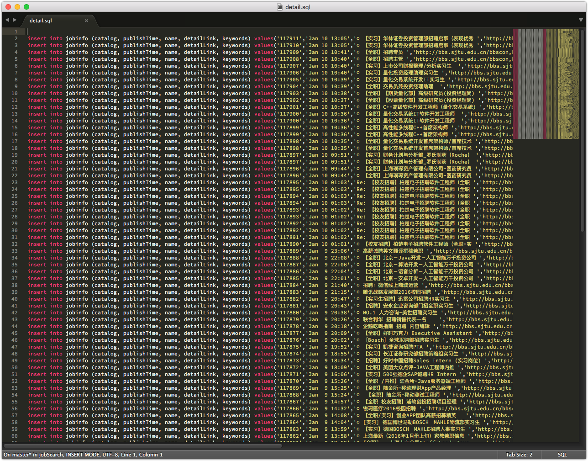

# A web crawler for job-hunting from BBS
    基于Scrapy构建的网络爬虫，用于获取就业信息
    
## How to use it
### 1. crawl
	scrapy crawl jobinfo
	
### 2. find keywords
	python jobSearchAdv.py info.json
	
## Example

[github源码](https://github.com/agenthun/JobSearch)